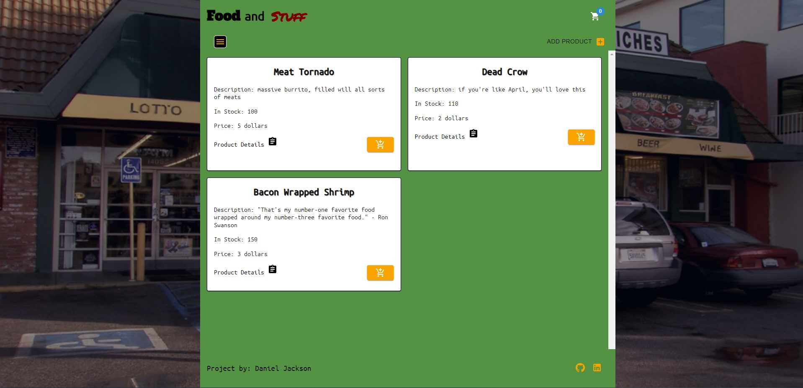
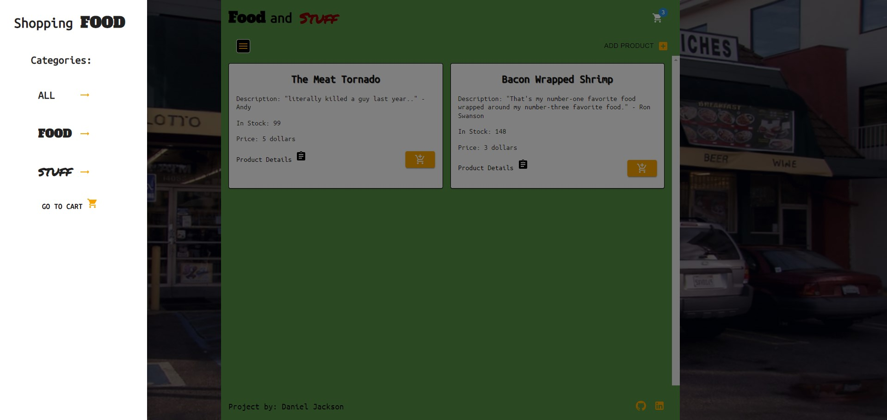
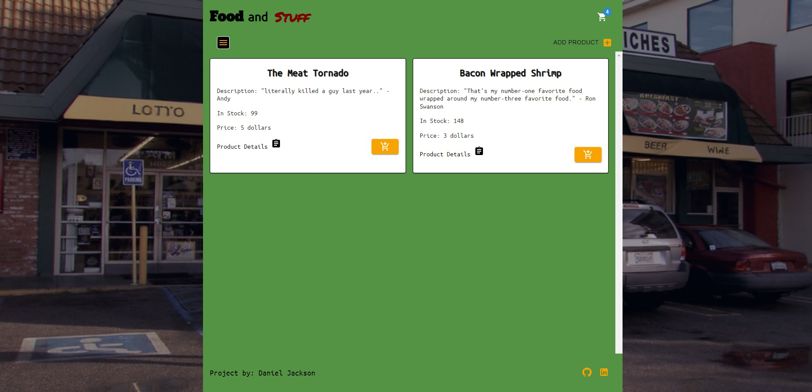
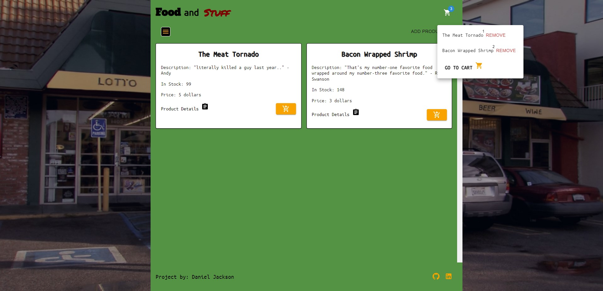

# todo-app
<br />
<!-- TABLE OF CONTENTS -->
<details>
  <summary>Table of Contents</summary>
  <ol>
    <li>
      <a href="#about-the-project">About The Project</a>
      <ul>
        <li><a href="#built-with">Built With</a></li>
      </ul>
    </li>
    <li>
      <a href="#getting-started">Getting Started</a>
      <ul>
        <li><a href="#prerequisites">Prerequisites</a></li>
        <li><a href="#installation">Installation</a></li>
      </ul>
    </li>
    <li><a href="#usage">Usage</a></li>
    <li><a href="#roadmap">Roadmap</a></li>
    <li><a href="#contributing">Contributing</a></li>
    <li><a href="#license">License</a></li>
    <li><a href="#contact">Contact</a></li>
    <li><a href="#acknowledgments">Acknowledgments</a></li>
  </ol>
</details>


<!-- ABOUT THE PROJECT -->
## About The Project

Inspired by the store "Food and Stuff" from my favorite TV show, Parks and Recreation.


<p align="right">(<a href="#top">back to top</a>)</p>

### Built With

* [React.js](https://reactjs.org/)
* [Express.js](https://expressjs.com/)

<p align="right">(<a href="#top">back to top</a>)</p>

## Getting Started

To get a local copy up and running follow these simple example steps within your CLI.

### Installation

1. Clone the repo
   ```sh
   git clone https://github.com/daniel-jacks/todo-app.git
   ```
3. Initialize git repo
   ```sh
   npm init -y
   ```
2. Install NPM packages
   ```sh
   npm install
   ```

<p align="right">(<a href="#top">back to top</a>)</p>

<!-- USAGE EXAMPLES -->
## Usage

Navigate and filter items using the menu
<br />
If you like an item, you can add it to the cart using the yellow button within each product card
<br />
You can use the dropdown cart menu in order to remove items from your cart quickly
<br />

<p align="right">(<a href="#top">back to top</a>)</p>

<!-- LICENSE -->
## License

Distributed under the MIT License. See `LICENSE.txt` for more information.

<p align="right">(<a href="#top">back to top</a>)</p>